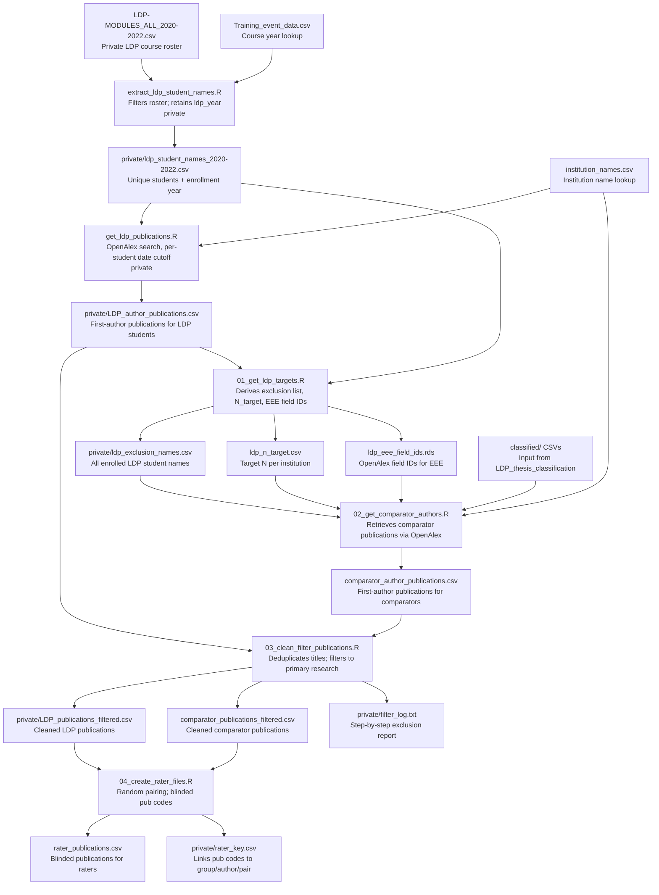

# LDP Find Articles

Retrieves first-author publications for Living Data Project (LDP) student cohorts and matched comparator authors via the OpenAlex API, as part of a quasi-experimental study assessing FAIR data compliance among LDP graduates.

**AI usage**: Claude Code (Sonnet 4.6) contributed to coding and ensuring computational reproducibility, with oversight by Jason Pither.

## Project Timeline

| Date | Activity |
|------|----------|
| 2025-10-10 | Project conceived |
| 2026-01-06 | Ethics approval (UBC BREB) |
| 2026-01-13 | [Pre-registration](https://github.com/pitherj/LDP_pre-registration/blob/main/LDP_preregistration_OSF.md) initiated |
| 2026-01-13 | README created |
| 2026-03-30 | README last updated |
| 2026-04-13 | Post-hoc corrections: five ineligible publications identified; scripts 05–08 added (see Addendum) |

---

## Background

The Living Data Project (LDP) trained Canadian graduate students in open science practices through four annual 1-credit modules (2020–2022). This project retrieves peer-reviewed, first-author publications for LDP student participants and institution-matched comparator students (identified by the companion [LDP_thesis_classification](https://github.com/pitherj/LDP_thesis_classification) pipeline) in preparation for FAIR compliance scoring.

The pre-registration for this study is available [here](https://github.com/pitherj/LDP_pre-registration/blob/main/LDP_preregistration_OSF.md).
---

## Quick Start

> **Prerequisites**: See [Prerequisites](#prerequisites) section. Private data files must be in place before running any script.

Run scripts in the following order:

```r
# Step 0 (private — restricted access)
source("scripts/private/extract_ldp_student_names.R")   # produces processed_data/private/ldp_student_names_2020-2022.csv
source("scripts/private/get_ldp_publications.R")         # produces processed_data/private/LDP_author_publications.csv

# Step 1 — derive LDP target artifacts
source("scripts/01_get_ldp_targets.R")

# Handoff: populate data/processed_data/classified/ from LDP_thesis_classification
# (output of 03_apply_classifier.R in that project)

# Step 2 — retrieve comparator author publications
source("scripts/02_get_comparator_authors.R")

# Step 3 — clean and filter publications
source("scripts/03_clean_filter_publications.R")

# Step 4 — create blinded rater files
source("scripts/04_create_rater_files.R")
```

---

## Pipeline Workflow



---

## Prerequisites

### R packages

Key packages (install individually or manage via `renv` if a lockfile is added):

| Package | Purpose |
|---|---|
| `openalexR` | OpenAlex API queries |
| `dplyr`, `tidyr`, `purrr` | Data wrangling |
| `readr` | CSV I/O |
| `here` | Portable file paths |
| `stringr` | String matching for keyword filters |

### Private data files

The following source files contain personally identifiable information and are not tracked in version control. Place them in `data/raw_data/` before running private scripts:

| File | Description |
|---|---|
| `LDP-MODULES_ALL_2020-2022.csv` | Full LDP course roster with student names, institutions, program, and course IDs |
| `Training_event_data.csv` | Course ID to year/title lookup table |

All derived files that contain student names are written to `data/processed_data/private/` and are git-ignored. See the [Privacy note](#privacy-note) below.

### External handoff

Before running `02_get_comparator_authors.R`, populate `data/processed_data/classified/` with the per-institution classified thesis CSVs produced by the [`LDP_thesis_classification`](https://github.com/pitherj/LDP_thesis_classification) project (`03_apply_classifier.R` output).

---

## Project Structure

```
LDP_find-articles/
├── README.md
├── scripts/
│   ├── 01_get_ldp_targets.R           # Derives exclusion list, N_target, EEE field IDs
│   ├── 02_get_comparator_authors.R    # Retrieves comparator author publications via OpenAlex
│   ├── 03_clean_filter_publications.R # Deduplicates titles; filters to primary research
│   ├── 04_create_rater_files.R        # Random year+institution pairing; blinded rater CSV
│   └── private/                       # Restricted-access scripts (private LDP roster data)
│       ├── extract_ldp_student_names.R  # Filters roster; adds ldp_year per student
│       └── get_ldp_publications.R       # OpenAlex search with per-student date cutoffs
└── data/
    ├── raw_data/                        # Private LDP source data + non-sensitive lookup files
    │   ├── LDP-MODULES_ALL_2020-2022.csv  # [private] Full course roster
    │   ├── Training_event_data.csv        # [private] Course year/title lookup
    │   ├── institution_names.csv          # Institution abbreviation → full name
    │   ├── ldp_n_target.csv               # Target comparator N per institution
    │   └── ldp_eee_field_ids.rds          # OpenAlex field IDs for EEE scope filter
    └── processed_data/
        ├── classified/                          # Input: *_classified.csv files from LDP_thesis_classification (03_apply_classifier.R output)
        ├── private/                             # [private] Derived files containing LDP student names
        │   ├── ldp_student_names_2020-2022.csv  # Unique students with ldp_year
        │   ├── LDP_author_publications.csv      # First-author pubs for LDP students
        │   ├── ldp_exclusion_names.csv          # All enrolled LDP student names (exclusion list)
        │   ├── LDP_publications_filtered.csv    # LDP pubs after deduplication + primary-research filter
        │   ├── filter_log.txt                   # Step-by-step exclusion report from script 03
        │   └── rater_key.csv                    # Links blinded pub codes to group/author/pair info
        ├── comparator_author_publications.csv   # First-author pubs for comparator students (raw)
        ├── comparator_checkpoint.rds            # Progress checkpoint for resumable comparator search
        ├── comparator_publications_filtered.csv # Comparator pubs after deduplication + primary-research filter
        └── rater_publications.csv               # Blinded publication list for FAIR compliance raters
```

### Privacy note

All derived files that contain LDP student names (personally identifiable information) are isolated in `data/processed_data/private/`. This directory is git-ignored. Files in `data/raw_data/` that do not contain student names (`institution_names.csv`, `ldp_n_target.csv`, `ldp_eee_field_ids.rds`) remain there.

---

## Key Outputs

| File | Description |
|---|---|
| `data/processed_data/private/ldp_student_names_2020-2022.csv` | Unique LDP students with institution, program, and `ldp_year` |
| `data/processed_data/private/LDP_author_publications.csv` | First-author articles for LDP student-authors (OpenAlex, raw) |
| `data/processed_data/private/ldp_exclusion_names.csv` | All enrolled LDP student names (used to exclude from comparator pool) |
| `data/processed_data/private/LDP_publications_filtered.csv` | LDP publications after deduplication and primary-research filtering |
| `data/processed_data/private/filter_log.txt` | Record of every record dropped at each filtering step |
| `data/processed_data/comparator_author_publications.csv` | First-author articles for comparator authors (raw) |
| `data/processed_data/comparator_publications_filtered.csv` | Comparator publications after deduplication and primary-research filtering |
| `data/processed_data/rater_publications.csv` | Blinded publication list (pub_id, title, doi, year, openalex_url) — shared with raters |
| `data/processed_data/private/rater_key.csv` | Links each blinded pub_id to its pair, group, author, and institution — not shared with raters |

---

## Documentation

| File | Contents |
|---|---|
| `DATA-DICTIONARY.md` | Column-level descriptions for all data files in `data/` |
| [LDP_pre-registration](https://github.com/pitherj/LDP_pre-registration/blob/main/LDP_preregistration_OSF.md) | Full study pre-registration including sampling, inclusion criteria, and analysis plan |
| [LDP_thesis_classification](https://github.com/pitherj/LDP_thesis_classification) | Companion repo: EEE thesis classifier used to identify comparator candidates |

---

---

## Addendum — Post-hoc Corrections (2026-04-13)

After the initial rater files were produced by script 04, five publications were identified as ineligible during rater review. Scripts 05–08 implement the corrections as a documented, reproducible pipeline layered on top of the original outputs. **Scripts 01–04 and their outputs are unchanged.**

### Reasons for exclusion

| pub_id | Pair | Group | Institution | Year | Reason |
|---|---|---|---|---|---|
| ZWKS9B | PAIR006 | LDP | McGill | 2024 | Not a primary research article |
| 47J7Y6 | PAIR020 | LDP | UBC | 2024 | Conference abstract |
| R75BCN | PAIR021 | Comparator | UBC | 2021 | Case study |
| OZ2HY7 | PAIR017 | Comparator | McGill | 2022 | Corresponding-author duplicate |
| TILMW1 | PAIR019 | Comparator | McGill | 2021 | Conference abstract |

The two LDP records (ZWKS9B, 47J7Y6) had no suitable replacement publication or author in the existing pool; their entire pairs were dropped. The three comparator records were replaced by randomly drawing from eligible candidates at the same institution and year (same random-selection principle as script 04, using a documented supplementary seed).

A sixth record (N3V3VY) was subsequently identified as inaccessible to raters (journal not available via UBC library subscription) and replaced by script 08.

An additional post-hoc exclusion criterion was identified during corrections: no individual should appear in the rater set in more than one role (first author on one paper; corresponding author on another). This criterion was applied programmatically using corresponding-author data fetched from OpenAlex (script 05). This criterion was not anticipated in the pre-registration and is documented as a post-hoc amendment.

### Correction scripts

| Script | Purpose |
|---|---|
| `05_fetch_corresponding_authors.R` | Fetches `is_corresponding` authorship data from OpenAlex for all publications in both filtered pools; adds `ca_display_names` and `ca_openalex_ids` columns |
| `06_drop_ineligible_pairs.R` | Drops PAIR006 and PAIR020 entirely |
| `07_replace_comparators.R` | Phase A: prints eligible candidates with CA-conflict flags. Phase B: randomly replaces R75BCN, OZ2HY7, TILMW1 |
| `08_replace_inaccessible.R` | Randomly replaces N3V3VY (inaccessible journal) |

### Correction script execution order

```r
# Enrich filtered pools with corresponding-author data
source("scripts/05_fetch_corresponding_authors.R")

# Drop the two ineligible LDP pairs
source("scripts/06_drop_ineligible_pairs.R")

# Replace the three ineligible comparators (Phase A then Phase B)
source("scripts/07_replace_comparators.R")

# Replace the inaccessible article
source("scripts/08_replace_inaccessible.R")
```

### Random seeds used in corrections

| Seed | Script | Purpose |
|---|---|---|
| `20260329` | `04_create_rater_files.R` | Original pairing and pub_id generation |
| `20260413` | `07_replace_comparators.R` | Replacement pub_id generation and random candidate selection |
| `20260414` | `08_replace_inaccessible.R` | Replacement pub_id generation and random candidate selection |

### Correction output files

The active rater files after all corrections are `rater_publications_final_v2.csv` and `private/rater_key_final_v2.csv`. All intermediate files are retained for auditability. See the Data Dictionary addendum for full file descriptions.

| File | Generated by | Description |
|---|---|---|
| `private/LDP_publications_filtered_with_ca.csv` | script 05 | LDP filtered pubs + CA columns |
| `comparator_publications_filtered_with_ca.csv` | script 05 | Comparator filtered pubs + CA columns |
| `rater_publications_pairs_dropped.csv` | script 06 | Rater pub list after dropping PAIR006 and PAIR020 |
| `private/rater_key_pairs_dropped.csv` | script 06 | Rater key after dropping PAIR006 and PAIR020 |
| `rater_publications_final.csv` | script 07 | Rater pub list after comparator replacements |
| `private/rater_key_final.csv` | script 07 | Rater key after comparator replacements |
| `rater_publications_final_v2.csv` | script 08 | **Active rater file** — includes `original` column |
| `private/rater_key_final_v2.csv` | script 08 | **Active key file** |

The `original` column in `rater_publications_final.csv` and `rater_publications_final_v2.csv` indicates whether a record was present in the original `rater_publications.csv` (`"yes"`) or is a correction-round replacement (`"no"`). This allows raters who began scoring from the original file to merge their assessments with the updated file.

---

## Authors

**Lead author and maintainer**

Jason Pither — [0000-0002-7490-6839](https://orcid.org/0000-0002-7490-6839)  
Department of Biology, University of British Columbia Okanagan  
Email: jason [dot] pither <at> ubc [dot] ca

**Co-investigators**

| Name | ORCID |
|---|---|
| Mathew Vis-Dunbar | [0000-0001-6541-9660](https://orcid.org/0000-0001-6541-9660) |
| Diane Srivastava | [0000-0003-4541-5595](https://orcid.org/0000-0003-4541-5595) |

**Raters** (independent FAIR compliance scoring)

| Name | ORCID | Rater ID in data |
|---|---|---|
| Jason Pither | [0000-0002-7490-6839](https://orcid.org/0000-0002-7490-6839) | JP |
| David Hunt | [0000-0002-7771-8569](https://orcid.org/0000-0002-7771-8569) | DH |
| Sandra Emry | [0000-0001-6882-2105](https://orcid.org/0000-0001-6882-2105) | SE |
| Jessica Reemeyer | — | JR |

---

## Ethics

This study received ethics approval from the UBC Behavioural Research Ethics Board (UBC BREB) on 2026-01-06.

---

## How to Cite

[TODO: add DOI once preprint and data archive are available]

If referencing the pre-registration:

> Jason Pither, Diane Srivastava, David AGA Hunt, Sandra Emry, Jessica Reemeyer, and Mathew Vis-Dunbar. (2026). *Assessing Open Science Practices Among Graduates of the Living Data Project, a Canada-wide Graduate Training Program*. OSF Pre-registration. https://osf.io/uyqt4/files/xjmyg

---

## License

Code in this repository is licensed under the [GNU General Public License v2](LICENSE).

---

## Acknowledgments

- Funded through the Canadian Institute of Ecology and Evolution (CIEE) NSERC CREATE program
- Some coding assisted by [Claude Code](https://claude.ai/code) (Anthropic)
